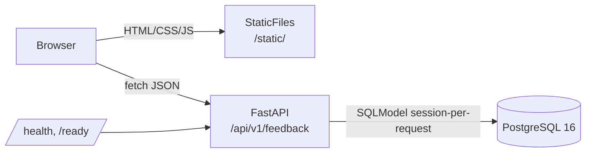

# feedback-triage-app

[](https://github.com/JoJo275/feedback-triage-app/actions/workflows/ci-gate.yml)
[](https://github.com/JoJo275/feedback-triage-app/actions/workflows/container-build.yml)
[](https://github.com/JoJo275/feedback-triage-app/actions/workflows/container-scan.yml)
[](https://codecov.io/gh/JoJo275/feedback-triage-app)
[](https://www.python.org/downloads/release/python-3130/)
[](https://github.com/astral-sh/ruff)
[](https://mypy-lang.org/)
[](https://github.com/pre-commit/pre-commit)
[](https://conventionalcommits.org)
[](LICENSE)

A small, portfolio-grade FastAPI + PostgreSQL service for triaging
incoming customer feedback. Create, list, view, update, and delete
`feedback_item` rows with `source`, `status`, and `pain_level` fields.

> Status: **v1.0 release candidate**. Continuous deploy from `main` to
> Railway is live; Phase 8 (polish & release) is in flight. See
> [`docs/project/implementation.md`](docs/project/implementation.md).

- **Live demo:** <https://feedback-triage-app-production.up.railway.app>
- **API docs:** <https://feedback-triage-app-production.up.railway.app/api/v1/docs>
- **Spec:** [`docs/project/spec/spec-v1.md`](docs/project/spec/spec-v1.md)

## Screenshots

Stored under [`docs/screenshots/`](docs/screenshots/) and committed once
captured against the live Railway deploy.

| Surface | File |
| --- | --- |
| List page with seeded data | `docs/screenshots/01-list.png` |
| Detail / edit page mid-edit | `docs/screenshots/02-detail.png` |
| `/api/v1/docs` Swagger UI | `docs/screenshots/03-docs.png` |

1. List page with seeded data
2. Detail / edit page mid-edit
3. `/api/v1/docs` Swagger UI

## Features

- Single resource (`feedback_item`) with sources, statuses, and a 1–5
  pain level enforced at the database layer with native enums and CHECK
  constraints.
- JSON CRUD API under `/api/v1/feedback` with offset pagination, filter,
  and sort.
- Static HTML + vanilla JS frontend served from the same origin.
- `/health` (liveness) and `/ready` (DB-aware, 2s timeout) probes.
- Hand-reviewed Alembic migrations with `compare_type` and
  `compare_server_default` enabled.
- Postgres-backed test suite plus a gated Playwright smoke suite.
- Multi-stage hardened container image, non-root, healthcheck-aware.

## Tech Stack

| Layer       | Choice                                                   |
| ----------- | -------------------------------------------------------- |
| API         | FastAPI                                                  |
| ORM         | SQLModel on top of SQLAlchemy 2.x                        |
| Validation  | Pydantic v2 + native Postgres enums + CHECK constraints  |
| Database    | PostgreSQL 16 + Alembic migrations                       |
| Frontend    | Static HTML + vanilla JS + Fetch API                     |
| Tests       | pytest + httpx TestClient + Playwright (e2e smoke)       |
| Build / env | uv (env, lock, Python install) + hatchling + hatch-vcs   |
| Tasks       | Task (`Taskfile.yml`)                                    |
| Container   | Multi-stage `Containerfile`, non-root, `HEALTHCHECK /health` |
| Deploy      | Railway (continuous deploy from `main`)                  |

## Architecture



## Local Setup

Prerequisites: [uv](https://docs.astral.sh/uv/), [Task](https://taskfile.dev/),
[Docker](https://docs.docker.com/get-docker/).

```bash
git clone https://github.com/JoJo275/feedback-triage-app
cd feedback-triage-app
cp .env.example .env                    # then edit POSTGRES_PASSWORD
uv sync                                 # creates .venv from uv.lock
task up                                 # start Postgres
task migrate                            # apply schema (after Phase 2)
task seed                               # demo data (after Phase 2)
task dev                                # FastAPI on http://localhost:8000
```

## Running Tests

```bash
task test       # API + unit suite (excludes e2e)
task test:e2e   # Playwright smoke suite (requires task up + task dev)
task check      # lint + format + typecheck + test (CI gate)
```

## Deployment

Continuous deploy on every merge to `main`. Railway pulls the repo,
runs `alembic upgrade head` as the pre-deploy command, then starts the
container. See [`docs/project/deployment-notes.md`](docs/project/deployment-notes.md)
for the full env-var surface and operational checklist.

## API Reference

OpenAPI / Swagger UI at `/api/v1/docs` once deployed. Do not duplicate
the schema in this README.

## Future Improvements

A trimmed list — the full set lives in
[`docs/project/spec/spec-v1.md#future-improvements`](docs/project/spec/spec-v1.md#future-improvements).

- Authentication and per-user feedback ownership
- Cursor / keyset pagination for large datasets
- Full-text search on title + description
- Duplicate detection on `POST /feedback`
- AI-assisted summarisation of feedback batches

## License

[Apache 2.0](LICENSE).
