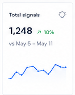

# Total signals widget update (reference parity)

> Doc-only implementation note. This file defines the target information model
> and implementation contract for a later code phase.

## Status

- Scope: implementation completed for the dashboard KPI card
- Runtime changes: implemented in dashboard template, CSS, and aggregator
- Target surface: dashboard KPI card `kpi-total-signals`

## Reference image



## Objective

Change the current **Total signals** KPI widget so it matches the reference
widget in terms of information shown while keeping existing v2 dashboard
structure intact.

## Current gap to close

| Element | Current dashboard card | Target card |
| --- | --- | --- |
| Label | `Total signals` | `Total signals` |
| Primary value | total count | total count |
| Delta surface | static text (`workspace total`) | directional period-over-period percent |
| Comparison text | not present | `vs <date range>` |
| Sparkline | not present in KPI card | received trend sparkline |
| Utility icon | not present | top-right utility/settings icon |

## Required information (Must)

1. Title label: `Total signals`
2. Top-right utility/settings icon
3. Primary metric value with thousands separator (example: `1,248`)
4. Period-over-period percentage delta with directional indicator
   (example: `+18%`)
5. Comparison caption line (example: `vs May 5 - May 11`)
6. Bottom sparkline showing the period trend

## Widget view model (recommended)

| Field | Type | Example | Notes |
| --- | --- | --- | --- |
| `widget_id` | string | `kpi-total-signals` | Stable dashboard widget id |
| `label` | string | `Total signals` | Fixed title |
| `value` | integer | `1248` | Raw count before formatting |
| `delta_pct` | number | `18.0` | Signed percent delta |
| `delta_direction` | enum | `up` | `up` \| `down` \| `flat` |
| `comparison_label` | string | `vs May 5 - May 11` | Human-readable baseline period |
| `sparkline_points` | number[] | `[4, 6, 5, 8, ...]` | Ordered counts for displayed window |

Recommended payload shape for the card:

```json
{
  "widget_id": "kpi-total-signals",
  "label": "Total signals",
  "value": 1248,
  "delta_pct": 18.0,
  "delta_direction": "up",
  "comparison_label": "vs May 5 - May 11",
  "sparkline_points": [4, 6, 5, 8, 7, 9, 8]
}
```

## Data derivation guidance

- Source `value` from `summary.kpi.total_signals`.
- Source sparkline from the received series in `summary.throughput.points`
  (same window as `THROUGHPUT_DAYS`).
- Build `comparison_label` from the immediate prior window of equal length.
- Compute `delta_pct` against the prior window total and round for display to a
  whole percent.
- Set `delta_direction` from sign of `delta_pct`:
  - positive -> `up`
  - negative -> `down`
  - zero -> `flat`

## Display and formatting rules

- Value format: integer with thousands separators.
- Delta format: signed percentage (`+18%`, `-7%`, `0%`).
- Keep the comparison caption on its own line directly below the
  value-plus-delta row.
- Keep sparkline in the lower area of the card and aligned to the same date
  window implied by `comparison_label`.
- Delta color and icon direction must match `delta_direction`.

## Edge-state behavior

| Scenario | Expected behavior |
| --- | --- |
| No data in both windows | `value=0`, `delta_pct=0`, `delta_direction=flat`, sparkline all zeros |
| Current window has data, previous window empty | show positive delta, keep explicit `vs <date range>` label |
| Previous window has data, current drops | show negative delta and down direction |
| Sparse daily data | render sparkline with zeros for missing days (no gaps) |

## Accessibility contract

- Keep a visible text label (`Total signals`) for the KPI.
- If the utility icon is interactive, it must be a real `<button>` with an
  accessible name.
- Sparkline must expose an `aria-label` describing metric and date window.
- Direction and percentage must not rely on color alone.

## Implementation touchpoints for later code phase

| Area | File |
| --- | --- |
| KPI markup and classes | `src/feedback_triage/templates/pages/dashboard/index.html` |
| Aggregation and period math | `src/feedback_triage/services/dashboard_aggregator.py` |
| API/dashboard summary tests | `tests/api/test_dashboard_summary.py` |
| Page-level rendering checks | `tests/api/auth/test_dashboard_page.py` |
| E2E accessibility pass | `tests/e2e/test_a11y.py` |

## Acceptance checklist (implementation)

1. The widget definition covers all six required reference elements.
2. Data derivation rules are deterministic and tied to existing dashboard
   summary surfaces.
3. Display rules define number formatting, sign handling, and sparkline scope.
4. Accessibility requirements are explicit for icon control and sparkline text.
5. Rendered output is covered by page tests and summary contract is covered by
  aggregator tests.

## Out of scope

- No API schema migration required for this widget update.
- No dashboard layout reorder or density preset changes.

## Related docs

- [../layouts/dashboard.md](../layouts/dashboard.md)
- [../ui.md](../ui.md)
- [dashboard-vanilla-js.md](dashboard-vanilla-js.md)
