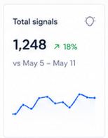
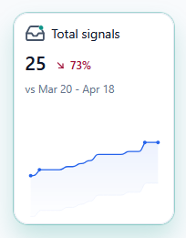

# Total signals widget (current implementation)

Implementation status: shipped in the live dashboard.

## Reference image (original target)



## Final product image (current)



## Final product wireframe (current)

```text
+----------------------------------+
| [inbox-badge] Total signals      |
|                                  |
| 25               ↘ 50%           |
| vs Mar 20 - Apr 18               |
|                                  |
|  •─•──•───•───────•────────•     |
|  ▁▁▂▂▂▂▂▃▃▃▃▃▄▅▅▅▅▅▅▅▅           |
+----------------------------------+
```

Wireframe notes:

1. The icon is at top-left beside the title (no top-right utility icon).
2. The value/delta row appears above the comparison line.
3. The trend sparkline occupies the lower visual area.
4. Entire card surface is one clickable target.

## Current visual contract

1. A top-left inbox badge icon appears beside the `Total signals` title.
2. The primary value is displayed with thousands separators.
3. The delta row shows direction icon + signed percentage.
4. The comparison label appears under the value row.
5. The sparkline occupies the lower half of the card.

## Current interaction contract

1. The full card surface is clickable and routes to `/w/{workspace_slug}/feedback`.
2. Hover cursor is `pointer` across the card surface, including the sparkline hit area.
3. Hover/focus uses a themed shadow based on `--color-primary`.
4. Sparkline marker labels use:
   - `Largest increase`
   - `Second-largest increase`

## Data and formatting contract

| Field | Type | Example | Notes |
| --- | --- | --- | --- |
| `widget_id` | string | `kpi-total-signals` | Stable dashboard widget id |
| `label` | string | `Total signals` | Fixed title |
| `value` | integer | `25` | Raw count before formatting |
| `delta_pct` | number | `-50.0` | Signed percent delta |
| `delta_direction` | enum | `down` | `up` \| `down` \| `flat` |
| `comparison_label` | string | `vs Mar 20 - Apr 18` | Human-readable baseline period |
| `sparkline_points` | number[] | `[0, 1, 1, 2, ...]` | Ordered counts for displayed window |

Display rules:

1. `value` renders as an integer with separators.
2. Delta renders as signed percent (`+18%`, `-50%`, `0%`).
3. Delta color/icon follows `delta_direction`.
4. Sparkline uses the same date window as the comparison label.

## Edge-state behavior

| Scenario | Expected behavior |
| --- | --- |
| No data in both windows | `value=0`, `delta_pct=0`, `delta_direction=flat`, sparkline all zeros |
| Current window has data, previous window empty | positive delta and explicit `vs <date range>` label |
| Previous window has data, current drops | negative delta with down direction |
| Sparse daily data | sparkline fills missing days with zeros (no gaps) |

## Accessibility contract

1. The visible title label remains `Total signals`.
2. Sparkline keeps an explicit `aria-label` with metric and window.
3. Direction and percentage do not rely on color alone.
4. Click target is keyboard-focusable and has an accessible link name.

## Implementation touchpoints

| Area | File |
| --- | --- |
| KPI markup + click target | `src/feedback_triage/templates/pages/dashboard/index.html` |
| KPI layout/styles | `src/feedback_triage/static/css/components.css` |
| Hover/focus effects | `src/feedback_triage/static/css/effects.css` |
| KPI aggregation math | `src/feedback_triage/services/dashboard_aggregator.py` |
| Page rendering checks | `tests/api/auth/test_dashboard_page.py` |

## Related docs

- [../layouts/dashboard.md](../layouts/dashboard.md)
- [../ui.md](../ui.md)
- [dashboard-vanilla-js.md](dashboard-vanilla-js.md)
